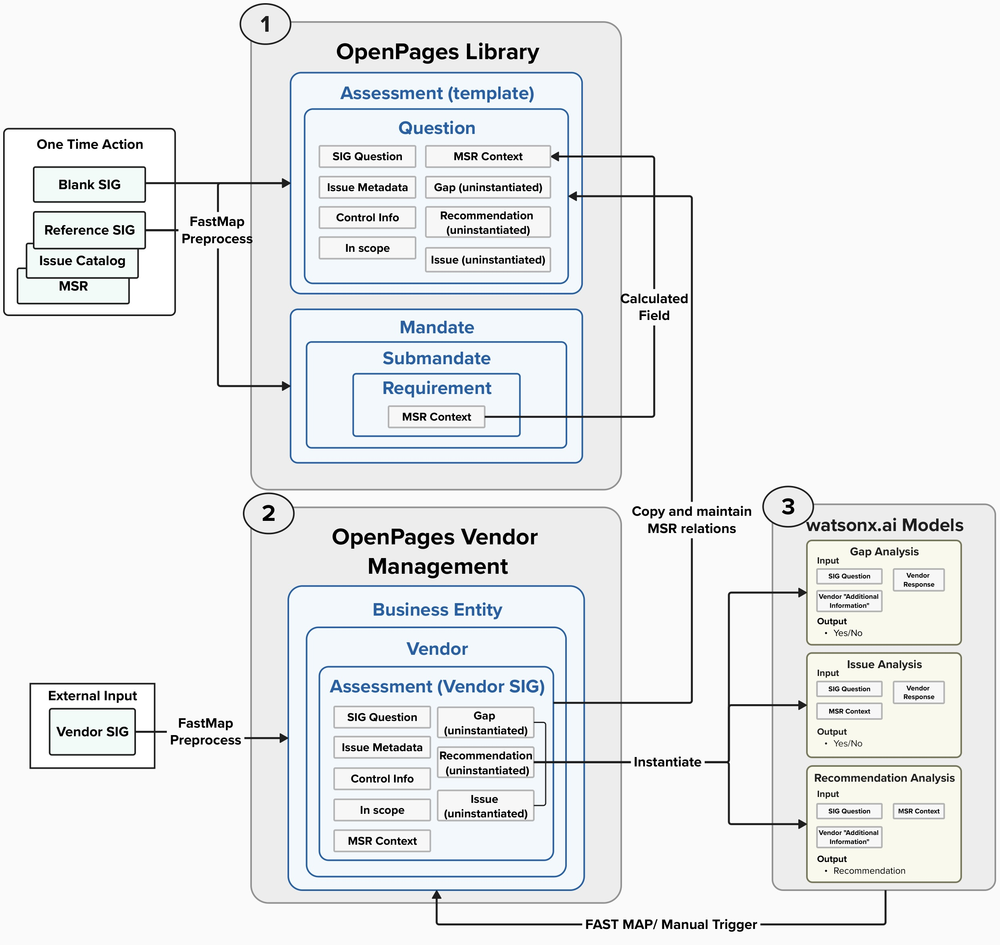

## Overview
----

This path combines the structure of IBM’s Open Pages platform with watsonx.ai while introducing an external compliance and security platform, KY3P, as an initial data input. While it achieves the same functionality and value as the first use case, leveraging Open Pages provides as an alternative platform that centralizes risk management and governance. In this setup, Open Pages acts as the primary platform which ensures structured data management, while watsonx.ai adds generative AI capabilities. By incorporating a third-party extract, this approach also accommodates additional data insights that may be outside the organization’s existing environment. It is well-suited for organizations/teams that require a centralized solution with external data integration, enriching analytics and extending the capabilities of watsonx.ai within one platform.

This solution consists of three core components:
1. Build OpenPages Library
2. Configure Openpages Vendor Management
3. Deploy and integrate watsonx.ai models and its content.

## Build OpenPages Library
-----
Building the OpenPages library emulates the same goal as creating the reference SIG in [Method: watsonx.ai Pipeline](/Overview/Methods/wxai%20Pipeline#create-reference-sig) as it builds the objects in OpenPages that will serve as the anchor/reference for every incoming vendor SIG. There are two core components to setup for the OpenPages library for this use case:

#### **1. Mandate**
The Mandate object relies on the MSR Data (and the reference SIG from [Method: watsonx.ai Pipeline](/Overview/Methods/wxai%20Pipeline) if applicable) to to store relationships relevant to the MSR. Each MSR mandate will include submandate objects, and each submandate will have an associated Requirement object.
- Submandate: the associated MSR "heading" for each SIG question
- Requirement: the associated MSR context for each SIG question

For more information on the MSR context go [here](/Overview/Methods/wxai%20Pipeline#preprocess-source-documents)

#### **2. An Assessment Template**
The assessment template will house all of the relevant information for each SIG question and will be used to create each new vendor assessment in OpenPages.

The assessment template relies on the Blank SIG data To build the assessment template, we will utilize the "Assessment" object in OpenPages, incorporating each SIG question through the "Question" object. Each SIG question will have fields associated with it:

<table>
  <tr>
    <th style={{width: '150px'}}>Field Name</th>
    <th style={{width: '290px'}}>Description</th>
    <th style={{width: '490px'}}>Example</th>
  </tr>
  <tr>
    <td>SIG Question</td>
    <td>Question text</td>
    <td>"Does the enterprise risk governance program include definitions of the roles and responsibilities for IT Governance?"</td>
  </tr>
  <tr>
    <td>Issue Metadata</td>
    <td>Information pertaining to the relevant issue for the SIG question</td>
    <td></td>
  </tr>
  <tr>
    <td>Control Info</td>
    <td>Information around the control associated with the SIG question</td>
    <td>"Policies, Standards, and Procedures"</td>
  </tr>
  <tr>
    <td>In Scope</td>
    <td>A flag to determine if the question was given to a vendor or not</td>
    <td>"Yes" or "No"</td>
  </tr>
  <tr>
    <td>Response</td>
    <td>A field to populate a vendor's response to the SIG question</td>
    <td>"Yes", "No", "N/A"</td>
  </tr>
  <tr>
    <td>Additional Comments</td>
    <td>A field to populate a vendor's additional comments to the SIG question</td>
    <td></td>
  </tr>
  <tr>
    <td>MSR Context</td>
    <td> A calculated field from the Requirement object with the relevant MSR context to the SIG question </td>
    <td>"Heading: II. IT Security Program Standard, Content: Managing information security risk, like risk management in general, is not an exact science. It brings together the best collective judgment of individuals and groups within organizations responsible for strategic planning, oversight, management, and day-to-day operations. etc.."</td>
  </tr>
</table>

 **Click [here](/Create/OpenPages%20Ext%20Input) to see how to implement**

## Configure Openpages Vendor Management
----
Configuring the OpenPages library emulates the same goal as creating the "Assessment Reports" in [Method: watsonx.ai Pipeline](/Overview/Methods/wxai%20Pipeline#create-assessor-report) as it sets up the necessary objects in OpenPages to leverage generative AI to build Vendor Assessments for each new SIG.

Each new vendor SIG is introduced through an external vendor SIG extract. A corresponding Business Entity object is then created in OpenPages, which generates a Vendor object. This Vendor object, in turn, creates an associated Assessment object for the Vendor SIG.

For each new Vendor SIG assessment, the content from the Vendor SIG template is copied to serve as the foundation. This provides a starting point for leveraging generative AI to populate the "Issue," "Gap," and "Recommendation" fields.

## Deploy and integrate watsonx.ai functions
-----

Generative AI is leveraged to populate the "Issue", "Gap" and "Reccomendation" field in a Vendor SIG Assessment. This use case leverages three different watsonx.ai models through Watson Machine Learning:
1. **Gap Analysis:** Determine whether or not the "Additional Comments" supports the vendor response for a specifc SIG question.
2. **Issue Analysis:** Determine whether or not the vendor response is most likley against industry and internal security standards.
3. **Reccomendation Analysis:** Leverage the MSR context and provided Additional Comments to provide an analysis on the delta and provide follow-up questions for the vendor.

