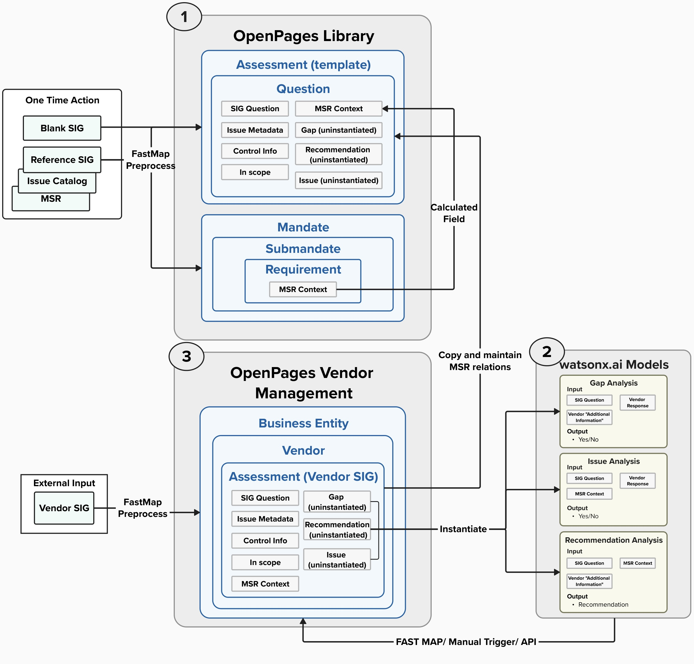
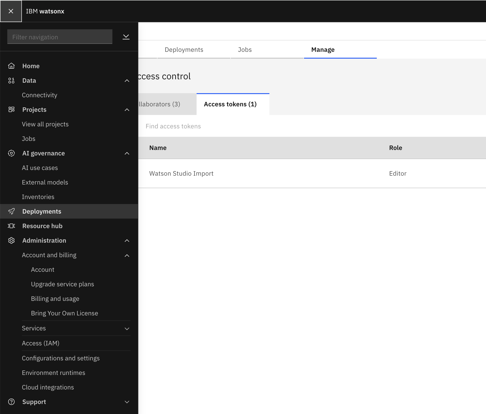
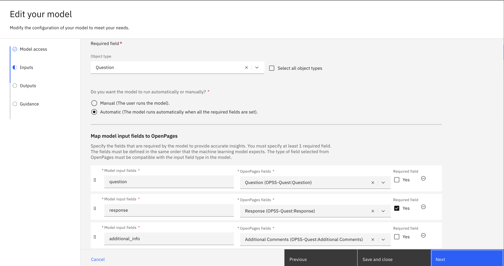
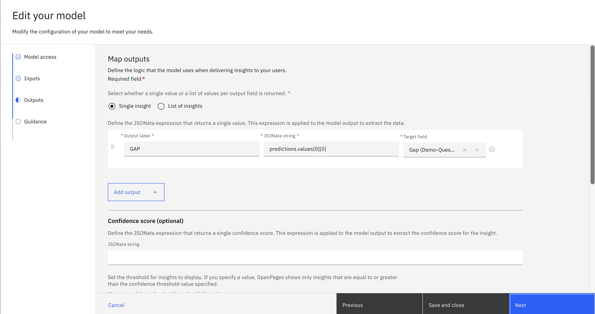

## Overview
------
To achieve the desired outcomes outlined in the business case, the process is divided into three core groups. While it is not strictly required to follow the steps in this exact sequence, it is recommended, as this was the approach that was successfully carried out:

1. **Build OpenPages Library**
    1. Create OpenPages File Directory
    2. Create Assessment Template
    3. Create Mandate and its MSR requirements

2. **Deploy and integrate watsonx.ai functions**
    1. Create and deploy WML functions with watsonx.ai prompts.
    2. Integrate to OpenPages platform
    3. Leverage the appropriate generative AI Watson Machine Learning function to populate the relevant fields.

3. **Configure OpenPages Vendor Management**
    1. Create Business Entity and Vendor
    2. Create Vendor SIG Assessment

## Build OpenPages Library
-----
### Create OpenPages File Directory
Create folder directory structure in OpenPages to set the groundwork to create the appropriate objects and import the relevant data inot the platform. 

For example: 
* Libraries/Assessment Templates/
* Libraries/Regulations and Standards/
* /Vendors/Vendor_1
* etc.

### Create Assessment Template
1. Create a new assessment object and create the relevant fields for the use case mentioned [here](/Overview/Methods/OpenPages%20Ext%20Input#2-an-assessment-template)

2. Populate FastMap file to import SIG questions and their relevant fields into the Assessment template.

3. [TODO: MSR context]
### Create Mandate

1. Populate FastMap file to import Requirements and the relevant MSR context to each SIG question number.

## Deploy and integrate watsonx.ai functions
------

1. In watsonx.ai create a new project. 
2. Navigate to the "Manage" tab, select "Services and Integrations" in the side menu and associate a WML service.
3. Navigate to the "Access Control" section in the side menu and select the "Access Tokens" tab. Select "New Access Token +", set an appropriate name and set the "Access Role" to "Editor". 
    :::tip
    Save the **Access Token** somewhere to be referenced later.
    :::
4. Navigate to the "Navigation Menu" in the top left of the watsonx platfrom and select "Deployments".
    
5. In the top right select "New deployment space +" and fill out the appropriate fields. Select the newly created deployment space.
6. Navigate to the "Manage" tab, and select the "General" section in the side bar and copy the Space GUID to be reference for later.
7. Navigate back to the "Navigation Menu" and select "IBM Cloud". In the IBM Cloud console select "Manage" in the top navigation bar and select Access (IAM) -> API keys and Create a new API key.
     :::tip
    Save the **API key** somewhere to be referenced later.
    :::
8. Navigate back to the watsonx project and create and deploy the relevant WML functions.
9. Once the functions are deployed got back to the deployment space that was created and save these values to be reference later:
    1. **Base Deployment URL:** All content until `/deployments` (ex. `https://us-south.ml.cloud.ibm.com/ml/v4`)
    2. **Deployment ID** 

10. In the OpenPages platform, select the "Open Administration menu" icon in the top navigation bar and select "Integrations" -> "Custom Machine Learning Models" -> "New Model +".
11. Under "Access Parameters" populate the following fields:
* **API key:** from step 7 above.
* **Base Deployment URL:** from step 9.i
* **Deployment id:** from step 9.ii
* **Space id:** from step 6
and click "Next"

12. Select the appropriate Object type to map to (ex. Question) and select either "Manual" or "Automatic".
13. Map the WML function input to the appropriate OpenPages values.
    
14. Select the appropriate label for the output and the target field and select "Next"
     

## Configure OpenPages Vendor Management
----
### Create Vendor SIG Assessment

1. Reformat the external vendor SIG file to align with the FastMap file structure, enabling its import into the OpenPages platform. This process facilitates the creation of a new Vendor SIG assessment and ensures the necessary data is populated accurately.

2. Leverage the watsonx.ai models created above to populate the "Issue", "Gap" and "Reccomendation" fields in the new Vendor SIG Assessment.